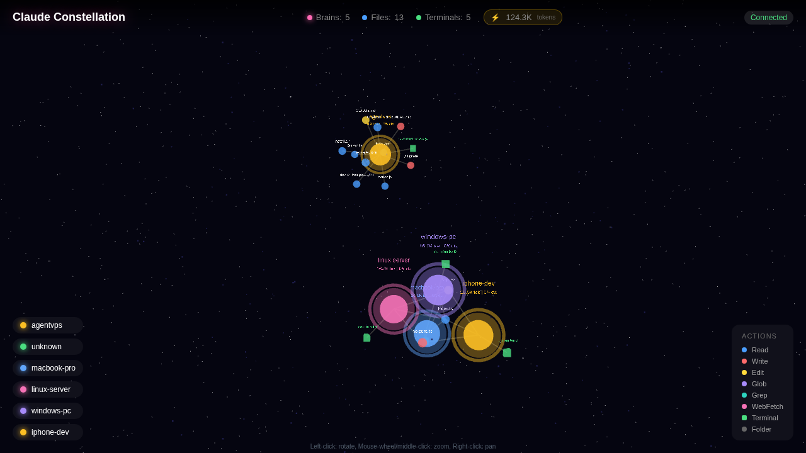

# Claude Constellation

Visualisation 3D en temps réel de l'activité de Claude Code sur plusieurs machines.



## C'est quoi ?

Claude Constellation visualise vos sessions Claude Code dans un magnifique graphe 3D. Regardez Claude lire des fichiers, écrire du code et exécuter des commandes - le tout rendu sous forme d'une constellation interactive de noeuds.

**Fonctionnalités :**
- Visualisation en temps réel des outils Claude Code
- Support multi-machines via Tailscale VPN
- Suivi des tokens (entrée, sortie, cache)
- Animations 3D avec THREE.js
- WebSocket pour des mises à jour instantanées

## Démarrage Rapide

### 1. Déployer le Serveur

```bash
# Cloner le dépôt
git clone https://github.com/thismad-claude/claude-constellation.git
cd claude-constellation

# Build et lancement avec Docker
# Note: -E préserve $HOME pour le mount du dossier .claude
sudo -E docker compose up -d --build

# Vérifier les logs
sudo docker logs claude-constellation
```

Le serveur tourne sur le port 3333.

### 2. Installer le Hook sur Votre Machine

Depuis n'importe quel répertoire de projet où vous utilisez Claude Code :

```bash
# Remplacez VOTRE_IP_SERVEUR par l'IP de votre serveur
curl -fsSL http://VOTRE_IP_SERVEUR:3333/install.sh | bash
```

Cela installe un hook PostToolUse qui envoie les événements à votre serveur Constellation.

### 3. Voir la Visualisation

Ouvrez `http://VOTRE_IP_SERVEUR:3333` dans votre navigateur.

## Architecture

```
┌─────────────────┐     Hook PostToolUse      ┌─────────────────┐     WebSocket      ┌─────────────────┐
│  Machine 1      │ ────────────────────────► │                 │ ◄───────────────► │                 │
│  (Mac/PC/VPS)   │                           │  Serveur:3333   │                   │  Navigateur     │
├─────────────────┤     POST /api/hook        │  Express +      │     Temps réel    │  Graphe 3D      │
│  Machine 2      │ ────────────────────────► │  WebSocket      │     Mises à jour  │  THREE.js       │
│  (tout appareil)│                           │  Server         │                   │  Visualisation  │
└─────────────────┘                           └─────────────────┘                   └─────────────────┘
```

## Configuration Multi-Machines avec Tailscale

[Tailscale](https://tailscale.com) est un VPN sans configuration qui crée un réseau sécurisé entre vos appareils. Parfait pour connecter plusieurs machines à votre serveur Constellation.

### Étapes de Configuration

1. **Installer Tailscale** sur votre serveur et toutes les machines clientes :
   ```bash
   # Linux
   curl -fsSL https://tailscale.com/install.sh | sh
   sudo tailscale up

   # macOS
   brew install tailscale
   tailscale up
   ```

2. **Noter l'IP Tailscale de votre serveur** (commence généralement par `100.x.x.x`) :
   ```bash
   tailscale ip -4
   ```

3. **Installer le hook sur les machines clientes** en utilisant l'IP Tailscale :
   ```bash
   export CONSTELLATION_SERVER="http://VOTRE_IP_TAILSCALE:3333"
   curl -fsSL http://VOTRE_IP_TAILSCALE:3333/install.sh | bash
   ```

4. **Accéder depuis n'importe quel appareil** sur votre réseau Tailscale, y compris mobile !

### Pourquoi Tailscale ?

- **Sécurisé** : Chiffrement de bout en bout, pas de ports ouverts nécessaires
- **Simple** : Fonctionne à travers NAT, pare-feux, sans redirection de ports
- **Mobile** : Accédez à votre constellation depuis votre téléphone
- **Gratuit** : Gratuit pour usage personnel (jusqu'à 100 appareils)

## Types de Noeuds

| Noeud | Forme | Couleur | Description |
|-------|-------|---------|-------------|
| Cerveau (Session) | Sphère lumineuse | Couleur machine | Session Claude active |
| Fichier | Petite sphère | Couleur de l'outil | Fichier accédé |
| Dossier | Octaèdre | Gris | Structure des répertoires |
| Terminal | Cube | Vert | Commandes Bash |

## Couleurs des Actions

| Action | Couleur | Description |
|--------|---------|-------------|
| Read | Bleu (#4a9eff) | Lecture de fichiers |
| Write | Rouge (#ff6b6b) | Création de fichiers |
| Edit | Jaune (#ffd93d) | Modification de fichiers |
| Glob | Violet (#a78bfa) | Recherche de patterns |
| Grep | Cyan (#2dd4bf) | Recherche de contenu |
| Bash | Vert (#4ade80) | Commandes terminal |
| WebFetch | Rose (#f472b6) | Récupération d'URLs |

## États du Cerveau

| État | Visuel | Déclencheur |
|------|--------|-------------|
| Inactif | Lueur faible | Pas d'activité depuis 30s |
| Actif | Anneau pulsant | Outil exécuté |
| Réflexion | Lueur violette | Traitement de réponse |
| Attente | Anneau orange | Dialogue de permission |

## Points d'API

| Endpoint | Méthode | Description |
|----------|---------|-------------|
| `/` | GET | Interface de visualisation 3D |
| `/api/state` | GET | État actuel en JSON |
| `/api/hook` | POST | Réception des événements |
| `/install.sh` | GET | Script d'installation |

## Tests

```bash
# Simuler un événement de lecture de fichier
curl -X POST http://localhost:3333/api/hook \
  -H "Content-Type: application/json" \
  -d '{
    "tool_name": "Read",
    "session_id": "test-session",
    "machine_name": "mon-laptop",
    "tool_input": {"file_path": "/home/user/projet/app.js"}
  }'

# Simuler une commande bash
curl -X POST http://localhost:3333/api/hook \
  -H "Content-Type: application/json" \
  -d '{
    "tool_name": "Bash",
    "session_id": "test-session",
    "machine_name": "mon-laptop",
    "tool_input": {"command": "npm install"}
  }'

# Vérifier l'état actuel
curl http://localhost:3333/api/state | jq
```

## Configuration

### Variables d'Environnement

| Variable | Défaut | Description |
|----------|--------|-------------|
| `PORT` | 3333 | Port du serveur |
| `CONSTELLATION_SERVER` | (requis) | URL du serveur pour le hook |
| `CONSTELLATION_MACHINE` | hostname | Nom de machine personnalisé |

### Nom de Machine Personnalisé

```bash
# Définir avant d'exécuter le script d'installation
export CONSTELLATION_MACHINE="mon-nom-custom"
curl -fsSL http://VOTRE_SERVEUR:3333/install.sh | bash
```

## Prérequis

- Node.js 18+ (20 recommandé)
- `jq` pour le suivi des tokens (installer : `apt install jq` ou `brew install jq`)
- Docker (optionnel, pour le déploiement conteneurisé)

## Stack Technique

- **Backend** : Node.js, Express, WebSocket (ws)
- **Frontend** : THREE.js, 3d-force-graph, three-spritetext
- **Déploiement** : Docker, Alpine Linux

## Dépannage

### Le hook ne fonctionne pas (bug connu)

**Important :** Le hook **ne fonctionne PAS** si vous l'installez dans la configuration utilisateur globale (`~/.claude/settings.json`).

Vous **devez** l'installer dans la configuration locale du projet (`.claude/settings.local.json`).

```bash
# Correct - configuration locale du projet
.claude/settings.local.json

# Incorrect - ne fonctionne pas !
~/.claude/settings.json
```

Le script d'installation (`install.sh`) gère cela automatiquement en créant le fichier `.claude/settings.local.json` dans votre répertoire de projet.

Si vous avez installé le hook manuellement dans `~/.claude/settings.json`, déplacez-le vers `.claude/settings.local.json` dans chaque projet.

### Tailscale ne se connecte pas après redémarrage Docker
```bash
sudo iptables -I DOCKER-USER -s 100.64.0.0/10 -j ACCEPT
```

### La session affiche "unknown" comme nom de machine
Redémarrer le conteneur pour effacer les sessions obsolètes :
```bash
docker restart claude-constellation
```

### Vérifier les logs du serveur
```bash
docker logs claude-constellation --tail 50
```

## Licence

MIT

## Crédits

Construit avec Claude Code sur agentvps.
